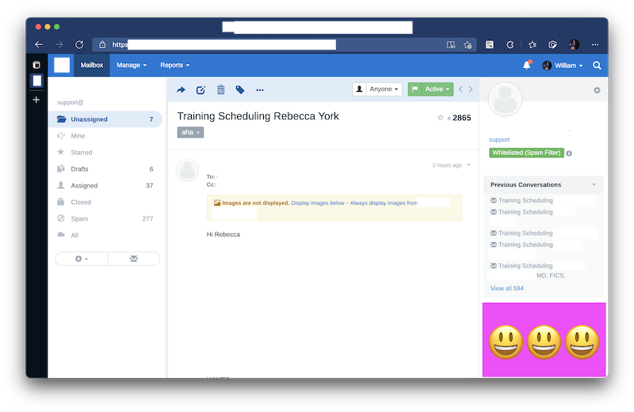

# FreeScout Sidebar Webhook

Sidebar Webhook asynchronously injects HTML from your server into conversation sidebars.

This screenshot shows what it does: you can load any content on a per-customer, per-message basis from your own web server, asynchronously, every time a conversation is loaded on the screen.

In this picture, the pink rectangle and happy faces were loaded from an external server based on the customer's email address.



## Use cases

- Directly link to your customer management system
- Show details about order status live from your fulfillment system
- Quickly ship changes to your FreeScout system UI without updating modules
- Connect to backends using PHP/Node.js/Ruby/Perl/Rust/Go/Bash/Haskell and even Java

## Installation

These instructions assume you installed FreeScout using the [recommended process](https://github.com/freescout-helpdesk/freescout/wiki/Installation-Guide), the "one-click install" or the "interactive installation bash-script", and you are viewing this page using a macOS or Ubuntu system.

Other installations are possible, but not supported here.

1. Download the [latest release of FreeScout Sidebar Webhook](https://github.com/fulldecent/freescout-sidebar-webhook/releases).

2. Unzip the file locally.

3. Open SidebarWebhookServiceProvider.php using a code editor and change the value of `WEBHOOK_URL` to be your endpoint's secret URL.

4. Copy the folder into your server using SFTP.

   ```sh
   scp -r ~/Desktop/freescout-sidebar-webhook root@freescout.example.com:/var/www/html/Modules/SidebarWebhook/
   ```

5. SSH into the server and update permissions on that folder.

   ```sh
   chown -r www-data:www-data /var/www/html/Modules/SidebarWebhook/
   ```

6. Access your admin modules page like https://freescout.example.com/modules/list.

7. Find **Sidebar Webhook** and click ACTIVATE.

8. Purchase a license code by sending USD 10 at https://www.paypal.com/paypalme/fulldecent/10usd

## Your webhook server

Your webhook server will receive requests of type `application/x-www-form-urlencoded` (in PHP, access with `$_POST`)

```json
{ 
    "customerEmail": "hello@example.com",
    "customerPhones": [],
    "conversationSubject": "Testing this email",
    "conversationType": "email",
    "mailboxId": 1,
    "csrfToken": "osnuthensuhtnoehu2398g3"
}
```

Your webhook server shall respond with a partial HTML document which is directly injected into the sidebar.

If your webhook server is on a different domain (e.g. crm.example.com) than your Free Scout server (e.g. freescout.example.com), then use like this HTTP header to avoid browser warnings/errors:

```
Access-Control-Allow-Origin: https://freescout.example.com
```

In PHP this can be acheived like:

```php
header('Access-Control-Allow-Origin: https://freescout.example.com');
```

## Project scope

Our goal is to have a very simple module to allow vast extensibility in the conversation sidebar.

Anything that makes it simpler (removes unneded code) or more extensible for most people (adding a couple post parameters in `boot()`) will be a welcome improvement.

At this point, it is a non-goal to add friendly configuration of `WEBHOOK_URL` or other configuration options.

## Inspiration

* This project was inspired by [Sidebar API](https://scoutdevs.com/downloads/sidebar-api/).
